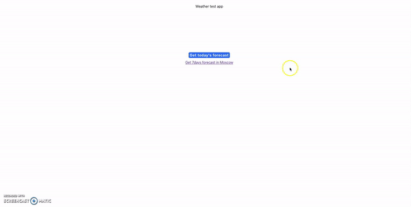

# Weather test app

Screens:
  - http://localhost:3000/current - today's forecast
  - http://localhost:3000/week - 7days forecast

## Scripts to get started

To start project, use the following command:

```
npm i
npm start
```
Open [http://localhost:3000](http://localhost:3000) to view result in the browser.

Or you can start project with Docker, use the following command:

```
docker build . -t weather 
docker run -it -p 3000:3000 weather
```

## Weather API

To get weather data, a free API (https://openweathermap.org/) is used.
Limits for free basis of usage are described here - https://openweathermap.org/full-price#current

## Description

A test application with React, Typescript that uses weather API to get data for current day and for 7days forecast.
Note: to keep things simple the city is hardcoded (Moscow). 

## Demo

